# Projektdokumentation - [BudgetTracker]

## Inhaltsverzeichnis

1. [Ausgangslage](#1-ausgangslage)
2. [Lösungsidee](#2-lösungsidee)
3. [Vorgehen & Artefakte](#3-vorgehen--artefakte)
    1. [Understand & Define](#31-understand--define)
    2. [Sketch](#32-sketch)
    3. [Decide](#33-decide)
    4. [Prototype](#34-prototype)
    5. [Validate](#35-validate)
4. [Erweiterungen [Optional]](#4-erweiterungen-optional)
5. [Projektorganisation [Optional]](#5-projektorganisation-optional)
6. [KI-Deklaration](#6-ki-deklaration)
7. [Anhang [Optional]](#7-anhang-optional)

> **Hinweis:** Massgeblich sind die im **Unterricht** und auf **Moodle** kommunizierten Anforderungen.

<!-- WICHTIG: DIE KAPITELSTRUKTUR DARF NICHT VERÄNDERT WERDEN! -->

<!-- Diese Vorlage ist für eine README.md im Repository gedacht. Abschnitte mit [Optional] können weggelassen werden, wenn in den Übungen nichts anderes verlangt wird. -->

## 1. Ausgangslage
- **Problem:** 
Schweizer Studierende leben mit knappem Monatsbudget aus BAföG, Nebenjob oder Elternunterhalt. Sie verlieren über den Monat den Überblick über viele Kleinstausgaben (Kaffee, ÖV-Ticket, Lebensmittel) und stehen am Monatsende oft unerwartet im Minus. Bestehende Lösungen helfen nur eingeschränkt: BudgetCH ist gestalterisch veraltet und wirkt für junge Nutzer nicht ansprechend, YNAB ist mit USD 109/Jahr zu teuer und für Einsteiger zu komplex, internationale Apps wie Money Manager bringen keine CH-Spezifika (Krankenkasse, ÖV, TWINT) mit. Die Folge: nach wenigen Tagen lässt die Motivation nach und die App wird wieder gelöscht.

- **Ziele:**
  - Schnelle, niederschwellige Erfassung von Ausgaben (max. 4 Felder pro Transaktion)
  - Klare visuelle Monatsübersicht mit Total und Verteilung pro Kategorie
  - Schweizer Alltagsbezug: CHF, vordefinierte Kategorien wie Lebensmittel, ÖV, Krankenkasse, Miete
  - Bewusst schlanker Funktionsumfang — wenige Funktionen, konsequent gut umgesetzt
  - Komplett kostenlos, kein Abo, kein Login

- **Primäre Zielgruppe:** Studierende in der Schweiz (ca. 18–28 Jahre) mit begrenztem Monatseinkommen, geringer Erfahrung in Budgetplanung und dem Wunsch nach einer einfachen, modernen App. Sie nutzen primär das Smartphone und erfassen Ausgaben unterwegs — direkt nach dem Einkauf oder nach dem Lösen eines ÖV-Tickets.

- **Weitere Stakeholder:** Mitfinanzierende Bezugspersonen (z. B. Eltern), die ein Interesse daran haben, dass das Budget eingehalten wird; Studienberatungsstellen, die solche Tools weiterempfehlen können.
 


## 2. Lösungsidee
Eine schlanke Web-App, die Studierenden den Überblick über ihre monatlichen Ausgaben gibt — ohne Bankanbindung, ohne Bezahlschranke, ohne überfrachtete Funktionen. Im Zentrum stehen drei Bildschirme (Monatsübersicht, Ausgabe erfassen, Verlauf), ergänzt durch eine Verwaltung der Kategorien.

- **Kernfunktionalität:**
  - **Ausgabe erfassen** (Workflow 1 — Happy Path): Betrag → Kategorie wählen → Datum → optionale Notiz → Speichern. Eingabe in unter 15 Sekunden.
  - **Monatsübersicht** als Startseite: Gesamtbetrag des ausgewählten Monats, Verteilung pro Kategorie mit Farb-Indikator und Prozentanteil; Monatsauswahl per Dropdown.
  - **History** (Workflow 2): chronologische Liste aller Transaktionen, nach Monat gruppiert, filterbar nach Kategorie, einzelne Einträge löschbar.
  - **Kategorien verwalten** (Workflow 3): vordefinierte Schweizer Standardkategorien (Lebensmittel, ÖV, Freizeit, Krankenkasse, Miete) plus eigene Kategorien mit Icon und Farbe hinzufügen oder löschen.
  - **Persistenz:** alle Daten in einer MongoDB-Datenbank — kein `localStorage`, sodass die App auch konzeptionell als ernsthafte Anwendung trägt.

- **Annahmen:**
  - Studierende sind bereit, Ausgaben manuell zu erfassen, wenn die Eingabe wirklich schnell geht (max. 15 Sek.).
  - 5–8 Standardkategorien werden besser genutzt als 30+ (zentrale Erkenntnis aus der Recherche).
  - Visuelles Feedback (Farben pro Kategorie, prozentuale Anteile) erhöht die Motivation am Dranbleiben.
  - Eine fehlende Bankanbindung ist für die Zielgruppe akzeptabel, da sie in der Schweiz ohnehin nicht standardisiert verfügbar ist.

- **Abgrenzung:**
  - Keine Bank-/PSD2-Anbindung, kein Belegscan / OCR, kein TWINT-Import
  - Kein Multi-User, kein Login, keine Synchronisation über mehrere Geräte
  - Keine Erfassung von Einnahmen — Fokus rein auf Ausgaben
  - Keine Investment-, Sparziel- oder Schuldenmanagement-Funktionen
  - Keine Push-Notifications oder E-Mail-Reports
  - Konzeptionell mobile-first, das aktuelle Layout ist desktop-orientiert ausgebaut

## 3. Vorgehen & Artefakte

### 3.1 Understand & Define
- **Zielgruppenverständnis:** Die Problemraumanalyse hat vier sich überlappende Felder identifiziert: *Finanzen & Alltag*, *Studierendenleben*, *Digitalisierung* und *Eigenverantwortung*. Im Schnitt dieser Felder lebt die Persona der App. Sie wurde entlang vier Dimensionen ausgearbeitet:

  | Dimension | Beschreibung |
  |---|---|
  | **Nutzer** | Studierende mit begrenztem Monatseinkommen aus BAföG, Nebenjob oder Elternunterhalt |
  | **Bedürfnisse** | Überblick über Ausgaben behalten, Monatsziel nicht überschreiten, Sparen ohne grossen Aufwand |
  | **Kontext** | Unregelmässige Einnahmen, viele Kleinstausgaben (Kaffee, ÖV, Lebensmittel), wenig Erfahrung mit Budgetplanung |
  | **Herausforderungen** | Kein Überblick am Monatsende, bestehende Apps zu komplex oder kostenpflichtig, fehlende Motivation nach wenigen Tagen |

  Die Konkurrenzanalyse im Schweizer App Store hat vier relevante Lösungen verglichen — BudgetCH (CH, kostenlos, aber gestalterisch veraltet), YNAB (international, USD 109/Jahr, sehr komplex), Money Manager (international, Freemium, nicht CH-spezifisch) und Expense Tracker Genius (international, iOS-only, viele Features). 
  
  Die **identifizierte Marktlücke**: keine kostenlose, einfache App mit modernem Design und CH-spezifischen Kategorien (Krankenkasse, ÖV, TWINT) speziell für Studierende.

  Die Recherche wurde mit drei *How-Might-We*-Fragen verdichtet, die als Brücke vom Problem zur Lösung dienen:
  - Wie könnten wir Studierenden helfen, ihre monatlichen Ausgaben schnell und mühelos zu erfassen, damit sie jederzeit wissen, wie viel Budget noch übrig ist?
  - Wie könnten wir Budgetziele so visualisieren, dass Studierende frühzeitig erkennen, wenn sie eine Kategorie zu stark belasten?
  - Wie könnten wir die Motivation zur Finanzkontrolle aufrechterhalten, ohne dass die App sich wie Arbeit anfühlt?

- **Wesentliche Erkenntnisse:**
  - **Designlücke im CH-Markt:** Die einzige CH-spezifische App (BudgetCH) wirkt veraltet — junge Nutzer haben kein attraktives Angebot.
  - **Fehlendes kostenloses Einstiegsmodell:** Bestehende Lösungen sind entweder zu teuer (YNAB) oder zu komplex (Money Manager) — eine niederschwellige Alternative fehlt.
  - **Manuelle Erfassung als Standard:** In der Schweiz ist eine automatische Bankverbindung praktisch nicht möglich. Die manuelle Eingabe muss daher so schmerzfrei wie möglich gestaltet werden.
  - **CH-typische Fixkosten als Pflicht:** Miete, Krankenkasse und ÖV müssen als Standardkategorien vorhanden sein (Quelle: BudgetHub CH).
  - **Visualisierung erhöht Motivation:** Fortschrittsbalken und Diagramme pro Kategorie erhöhen nachweislich die Nutzungsdauer (Quelle: Expense Tracker Genius).
  - **Weniger ist mehr:** 5–8 Standardkategorien werden besser genutzt als 30+; eine App, die drei Dinge gut macht, wird mehr genutzt als eine mit Funktionsfülle.

  Diese Erkenntnisse verdichten sich zu drei Leitprinzipien für die Lösung: **schlank**, **schweizerisch**, **schnell**.

### 3.2 Sketch
- **Variantenüberblick:** Im Rahmen der Ideenfindung wurden mit der **Crazy-8's-Methode** acht alternative Skizzen pro Bildschirm bzw. Funktion in kurzer Zeit entworfen, anschliessend von Peers kommentiert und gegeneinander abgewogen. Ziel war es, möglichst breit zu denken und nicht vorschnell auf die erste Idee zu setzen. Die acht Varianten unterscheiden sich darin, **was zuerst sichtbar ist** (Total, Kategorien, Trend, Status) und **wie Erfolg visualisiert wird** (Zahlen, Balken, Häkchen).

  | # | Skizze | Idee in einem Satz | Kernfeedback |
  |---|---|---|---|
  | 1 | Budget-Tracker Übersicht | Kategorien als Kacheln, Total oben | Fortschrittsbalken pro Kategorie wären sinnvoll |
  | 2 | Ausgabe erfassen | Klassisches Formular mit Betrag, Kategorie, Kommentar | Datum vorausfüllen, Speichern-Button prominenter |
  | 3 | Monatsübersicht | Balkendiagramm pro Kategorie + Total | Gesamtsumme oben gross anzeigen — sonst überzeugend |
  | 4 | Essen Detailansicht | Drilldown in eine Kategorie mit Einzelausgaben | Gesamtsumme der Kategorie oben wäre hilfreich |
  | 5 | Deine Ausgaben im Blick | Top-Liste mit Beträgen pro Kategorie | Balken statt nur Zahlen wäre intuitiver |
  | 6 | Historia | Liste vergangener Monate als Trendüberblick | Filter nach Kategorie wäre eine sinnvolle Ergänzung |
  | 7 | Budget pro Monat | "Ziel erreicht / nicht erreicht" pro Monat | Differenz farbig hervorheben wäre wirkungsvoller |
  | 8 | Monatsstatus | Häkchen/Kreuze pro Monat als Status-Liste | Besten Monat farblich auszeichnen wäre motivierend |

- **Skizzen:**
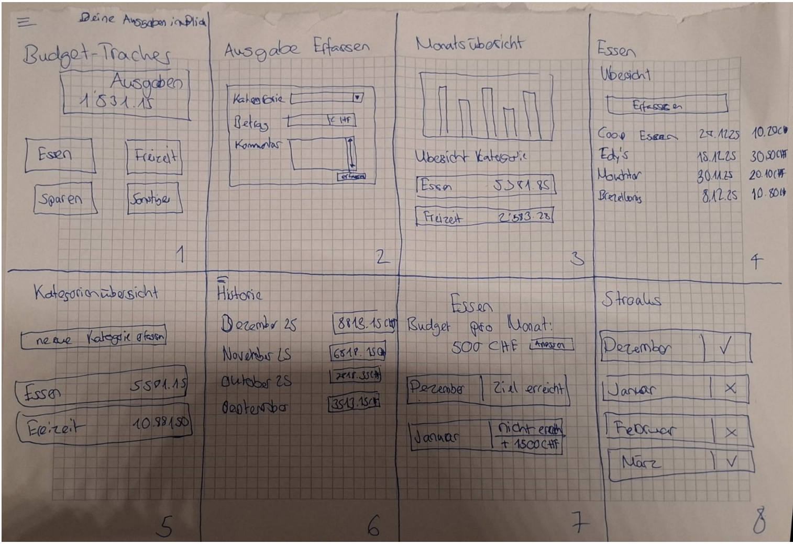
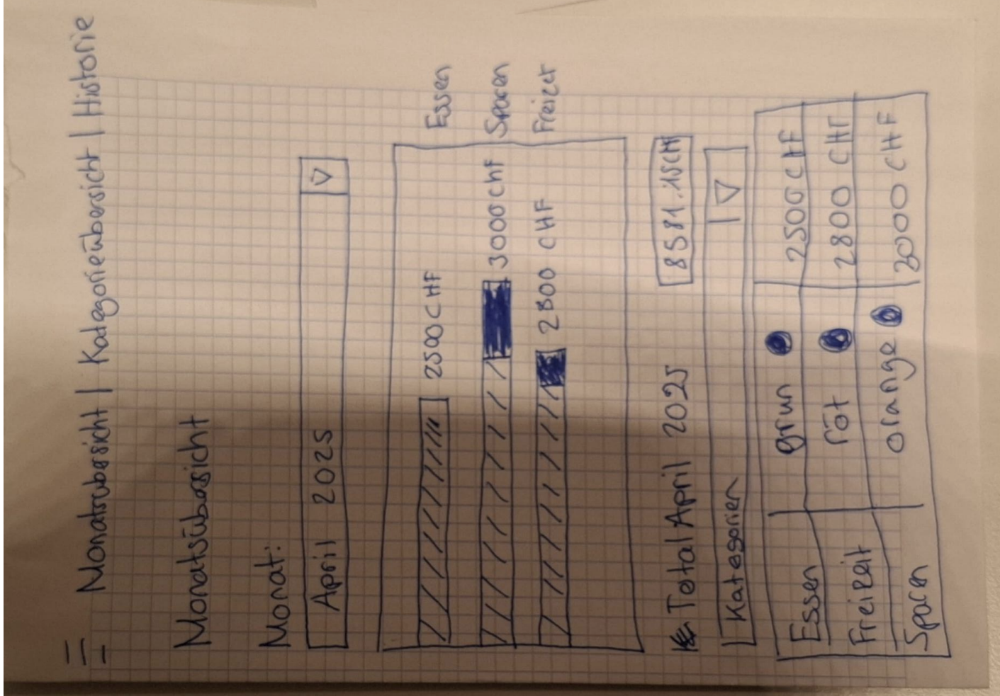

### 3.3 Decide
- **Gewählte Variante & Begründung:** Ausgewählt wurde **Skizze 3 — Monatsübersicht** mit Balkendiagramm pro Kategorie und Total. Sie ist das Herzstück der App, weil sie die wichtigste Frage des Nutzers in einem Blick beantwortet: *Wohin ist mein Geld geflossen?* Das Balkendiagramm macht Ausgabenmuster sofort sichtbar, ohne dass Zahlen verglichen werden müssen. Das Peer-Feedback wurde direkt eingearbeitet — die Gesamtsumme erscheint nun gross über dem Diagramm, die Kombination aus Zahlen und Balken bleibt erhalten.

  Auf dieser Entscheidung aufbauend wurden in Übung 10 weitere Designentscheide getroffen, die den Prototyp prägen:
  - **Mobile vs. Desktop:** Konzipiert als mobile Web-App, weil Studierende Ausgaben unterwegs erfassen — direkt nach dem Einkauf oder nach dem ÖV-Ticket. (Im umgesetzten Prototyp wurde das Layout vorerst auf Desktop ausgebaut.)
  - **Navigation:** Fixe Top-Navigation mit vier Punkten — Overview, Add, History, Categories. Auf Mobile intuitiv, immer sichtbar, kein Zurücknavigieren nötig.
  - **Hauptseite:** Die Monatsübersicht ist die Startseite, weil sie die wichtigste Frage sofort beantwortet.
  - **Erfassungsformular:** Bewusst kurz — Betrag, Kategorie, Datum, optionale Notiz. Mehr nicht. Das Datum ist auf heute vorausgefüllt, um die Eingabe zu minimieren.
  - **Kategorien:** Vordefinierte Schweizer Standardkategorien (Lebensmittel, ÖV, Freizeit, Krankenkasse, Miete) sind ab Start vorhanden und können ergänzt werden.

- **End-to-End-Ablauf:** Drei zentrale Workflows decken den Alltag der Zielgruppe ab.

  - **Workflow 1 — Ausgabe erfassen (Happy Path):**
    Nutzer öffnet App → landet auf Monatsübersicht → tippt auf *Add* in der Navigation → gibt Betrag ein → wählt Kategorie → Datum ist bereits ausgefüllt → tippt auf *Speichern* → wird zurück zur Monatsübersicht geleitet → neue Ausgabe erscheint in der Liste.

  - **Workflow 2 — Ausgaben prüfen:**
    Nutzer öffnet App → sieht Monatsübersicht mit Gesamtbetrag und Kategorien → tippt auf *History* → sieht alle Transaktionen nach Monat gruppiert → scrollt durch vergangene Monate, optional filtert er nach Kategorie.

  - **Workflow 3 — Kategorien verwalten:**
    Nutzer tippt auf *Categories* → sieht alle Kategorien mit bisherigen Ausgaben → kann neue Kategorie mit *+* hinzufügen oder bestehende löschen.

  Diese drei Pfade kreuzen sich in der **Monatsübersicht** als Drehscheibe — alles führt zurück dorthin.

- **Mockup:** Statt eines digitalen Mockups wurde bewusst auf ein zweites Set **handgezeichneter Wireframes** mit Balsamiq gesetzt (Übung 10), eine Stufe detaillierter als die Crazy-8-Skizzen. Vier zentrale Screens wurden ausgearbeitet:

  - **Overview:** Monat per Pfeil wechselbar (im Prototyp später durch Dropdown ersetzt), Total in CHF gross zentriert, Balken pro Kategorie inkl. Budget-Markierung (rote Linie), Kategorienliste mit Icon und Mini-Bar.
  - **Add Transaction:** Betrag prominent, Kategorie-Grid mit 6 Buttons (3×2), Datum-Picker, Notiz-Feld, blauer *Speichern*-Button.
  - **History:** Transaktionen nach Monat gruppiert (April, März, Februar …), Filter-Icon oben rechts.
  - **Categories:** Liste aller Kategorien mit Total in CHF, FAB *+* zum Hinzufügen. 

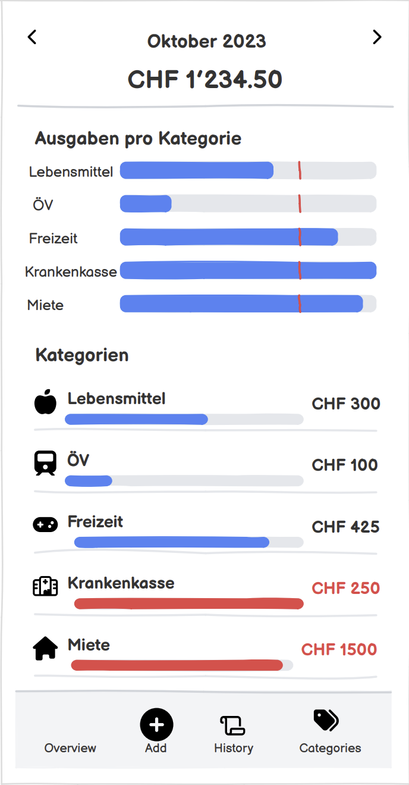
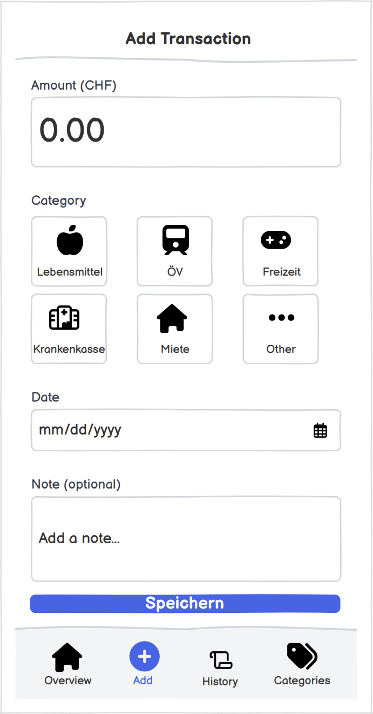
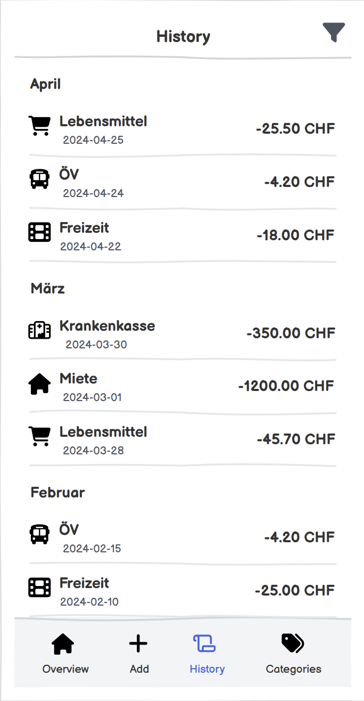
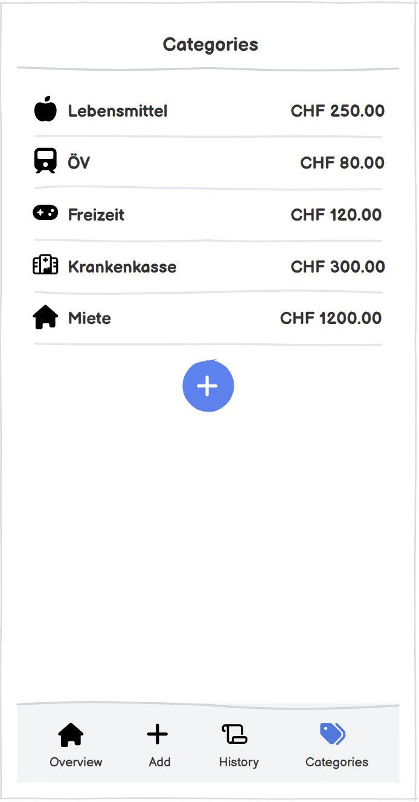

### 3.4 Prototype

#### 3.4.1. Entwurf (Design)

- **Informationsarchitektur:** Die App besteht aus **vier gleichrangigen Bildschirmen**, die über eine flache, jederzeit sichtbare Navigation erreichbar sind — keine Untermenüs, kein Drilldown, kein Breadcrumb. Die Logik dahinter: Studierende sollen aus jedem Zustand mit maximal einem Klick zur nächsten Aktion gelangen.

  | Bildschirm | Route | Zweck |
  |---|---|---|
  | **Overview** | `/` | Startseite — Total und Verteilung pro Kategorie für den ausgewählten Monat |
  | **Add** | `/add` | Erfassen einer neuen Transaktion |
  | **History** | `/history` | Chronologische Liste aller Transaktionen mit Lösch-Funktion |
  | **Categories** | `/categories` | Verwaltung (Anlegen, Löschen) der Kategorien |

  Im Header sitzt links das Logo („Budget Tracker — Deine Ausgaben im Blick") als Link zurück zur Overview, rechts die Navigationsleiste mit drei Buttons: *Add* (Primary-Blau, da Haupt-Aktion), *History* und *Categories* (Dark, sekundär). Die Monatsauswahl auf der Overview ist als Dropdown realisiert; sie schreibt einen URL-Parameter `?month=YYYY-MM`, sodass jeder Monat eine eigene teilbare URL hat und der Browser-Back-Button konsistent funktioniert.

- **User Interface Design:** Vier Screens decken den vollständigen Funktionsumfang ab:

  **Overview (`/`)** — Dropdown zur Monatswahl oben, gefolgt von einer zentrierten Card mit dem grossen Gesamtbetrag („Total Spending"), darunter eine Bootstrap-`list-group` mit allen Kategorien und ihrem jeweiligen Monats-Total als Badge. Die Liste ist nach Reihenfolge der Kategorien in der DB, der Fokus liegt auf dem Total als Einstiegs-Information.

  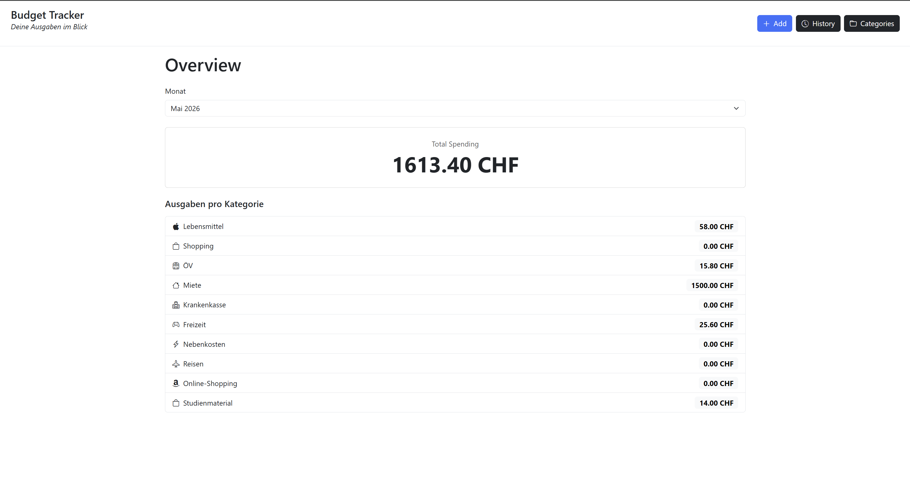

  **Add (`/add`)** — „Back"-Button oben links für Rückkehr ohne Browser-Back-Button. Eine einzige Card enthält das gesamte Formular: Amount (number, step 0.01), Category (select), Date (date), Note (text, optional). Submit-Button als Primary mit Plus-Icon. Erfolg und Fehler werden als Bootstrap-Alert *im Seitenkopf* angezeigt — bewusst keine Modals/Toasts, da der gesamte Flow auf einer Seite bleibt.

  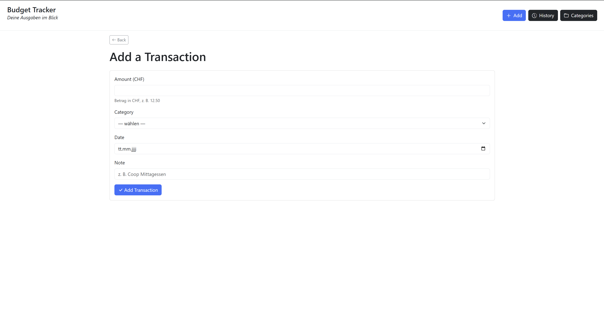

  **History (`/history`)** — H1 mit Counter-Badge (z. B. „History 42") für sofortige Mengen-Information. Jede Zeile zeigt links Kategorie-Badge (Icon + Name) und darunter Datum + Note in kleinerer Schrift, rechts den Betrag (negativ formatiert mit Minus-Zeichen) und den Lösch-Button.

  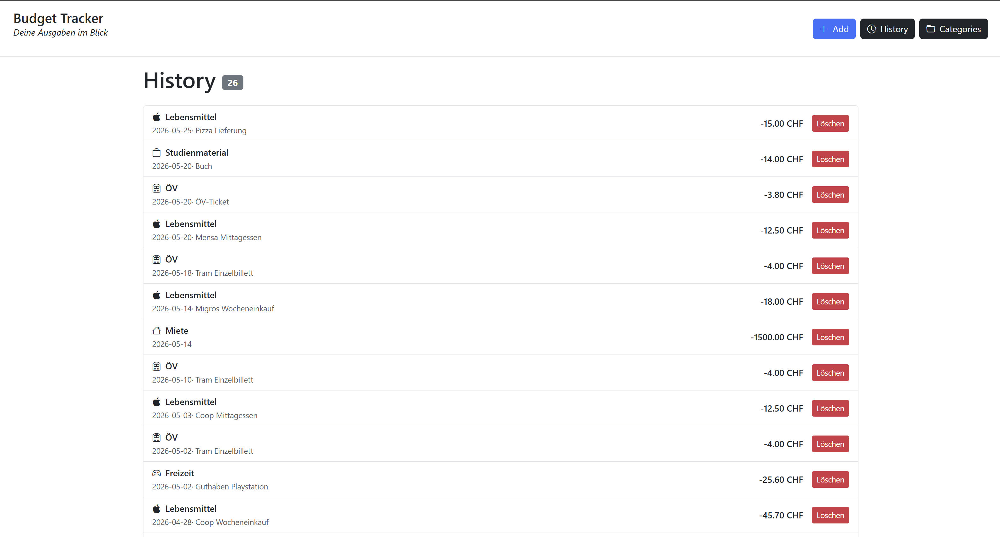

  **Categories (`/categories`)** — Bestehende Kategorien als Liste mit Delete-Button (mit Warnung, dass alle zugehörigen Transaktionen mitgelöscht werden), darunter Trennlinie und das Add-Form: Name und Icon (als Bootstrap-Icon-Klassenname, z. B. `apple`, `bag`, `train-front`), mit Verweis auf [icons.getbootstrap.com](https://icons.getbootstrap.com/).

  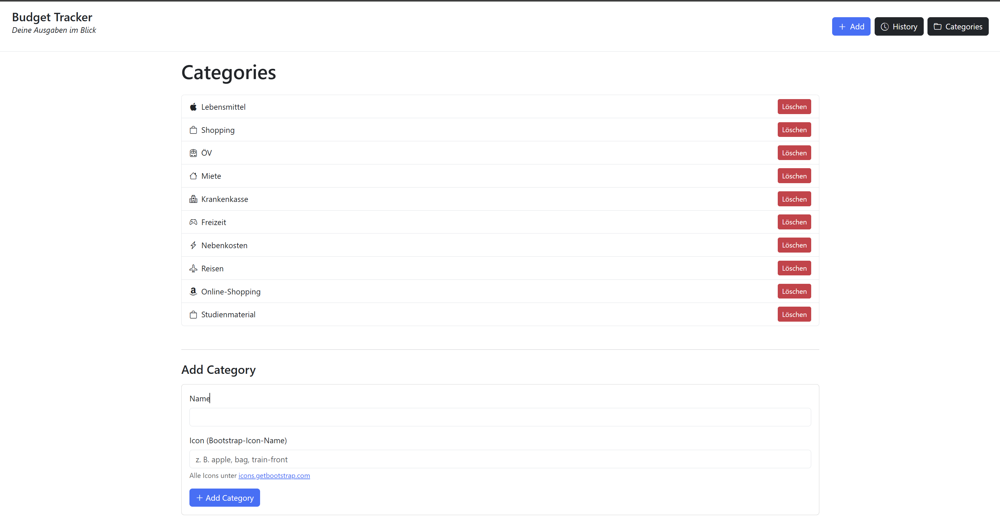

- **Designentscheidungen:**
  - **Bootstrap Icons** für Kategorien (Icon-Name in der DB gespeichert) — über 1700 Icons abgedeckt, keine eigene Asset-Pipeline nötig.
  - **Farbliche Hierarchie nach Aktion:** Primary-Blau für Hauptaktionen (Add, Speichern), Dark für Navigation, Danger-Rot ausschliesslich für destruktive Aktionen (Löschen). Damit ist die Konsequenz jedes Buttons an seiner Farbe ablesbar.
  - **CHF als feste Währung** — eigene `Money`-Komponente formatiert mit `toFixed(2)` und optionalem Minus-Präfix für History-Einträge. Keine Internationalisierung nötig.
  - **Monat als URL-Parameter** (`?month=2026-05`) — bookmarkbar, share-bar, Browser-Back funktioniert natürlich.
  - **Top-Navigation statt Bottom-Navigation:** Das Mockup sah eine untenliegende Navigationsleiste (Bottom Navigation) vor. Bewusst entschieden wurde stattdessen eine fixe Top-Navigation im Header — sie passt zum desktop-orientierten Layout des Prototyps und hält Logo und Menüpunkte an einer Stelle.


#### 3.4.2. Umsetzung (Technik)

- **Technologie-Stack:**

  | Schicht | Technologie
  |---|---|
  | Framework | SvelteKit (File-based Routing, Server Actions)
  | UI-Library | Svelte (Runes: `$props`, `$state`)
  | Datenbank / Treiber | MongoDB Atlas · `mongodb`
  | CSS / Icons | Bootstrap + Bootstrap Icons (CDN)
  | Hosting / Adapter | Netlify · `adapter-netlify` (`split: false`)

  Entwickelt in VS Code, versioniert mit Git/GitHub, Paketverwaltung über npm. Bewusst kein TypeScript (`checkJs: false`) und **kein eigener Store**: Daten kommen serverseitig aus der `load`-Funktion und werden via `$props()` an die Komponenten gereicht; nach jedem Form-Submit lädt SvelteKit automatisch neu, sodass die UI ohne Client-State aktuell bleibt.

- **Struktur:** SvelteKit-Konvention — `src/routes/` für die vier Seiten (je `+page.svelte` + `+page.server.js`), `src/lib/` für `db.js` und drei wiederverwendbare Komponenten (`CategoryBadge`, `Money`, `DeleteButton`).

  ```
  src/
  ├── app.html                 # HTML-Shell, lädt Bootstrap (CDN)
  ├── lib/
  │   ├── db.js                # MongoDB-Connection + CRUD
  │   └── components/          # CategoryBadge, Money, DeleteButton
  └── routes/
      ├── +layout.svelte       # Header + Navigation
      ├── +page.*              # Overview
      ├── add/                 # Add        (action: create)
      ├── history/             # History    (action: delete)
      └── categories/          # Categories (actions: create, delete)
  ```

- **Daten & Schnittstellen:** MongoDB-Atlas-Datenbank `BudgetTrackerDB` mit zwei Collections:

  ```js
  // categories
  { _id, name, icon }
  // transactions
  { _id, amount, categoryId, date, note }
  ```

  Die Verbindung wird in `db.js` einmalig per Top-Level-`await` aufgebaut (`DB_URI` aus `$env/static/private`). Es gibt **keine eigenen REST-Endpoints**: Jede Route hat eine `load`-Funktion (lesen) und Form-Actions (`create`/`delete`) für Mutationen. `deleteCategory` löscht **kaskadierend** auch die zugehörigen Transaktionen. 
  
  `_id` wird an der Modulgrenze in einen String gewandelt; die **Monatsfilterung** läuft client-seitig im Server-Load (`date.startsWith(month)`), die **Validierung** ausschliesslich serverseitig.

  > **Hinweis:** Im Endprojekt (Kap. 4) wurde diese Datenschicht erweitert — eine zusätzliche `users`-Collection und eine `recurringTransactions`-Collection kamen hinzu, und jedes Dokument trägt eine `userId`, nach der jede Query filtert. Für den Verlauf-Filter (#12) kommt zudem eine echte MongoDB-Query (`$gte`/`$lte`/`$regex`) zum Einsatz; die Monatsauswertungen laufen weiterhin client-seitig im Server-Load.

- **Deployment:** https://budgettrackerforschool.netlify.app

- **Wichtigste Trade-offs:**
  - **Keine Authentifizierung** — alle Tester teilen eine DB; hält den Prototyp einfach (Multi-User als Erweiterung in Kap. 4).
  - **Bootstrap via CDN** statt Bundle — spart Setup, koppelt aber an `cdn.jsdelivr.net`.
  - **Nur Create/Read/Delete, keine Edit-Funktion** — im Usability-Test (Kap. 3.5) als grösster Schmerzpunkt erkannt.
  - **Client-seitiger Monatsfilter** — bis ~1000 Einträgen unkritisch, danach wäre eine MongoDB-Aggregation nötig.

### 3.5 Validate

- **URL der getesteten Version:** https://budgettrackerforschool.netlify.app

- **Ziele der Prüfung:** Mit dem Usability-Test sollen drei Leitfragen beantwortet werden:
  1. Finden Studierende ohne Anleitung durch die vier Bildschirme (Overview / Add / History / Categories)?
  2. Lassen sich Alltagsaufgaben (Erfassen, Korrigieren, Auswerten) effizient lösen?
  3. Welche Funktionen fehlen oder wirken unfertig und sollen als Nächstes umgesetzt werden?

- **Vorgehen:** Drei moderierte Tests vor Ort mit Mitstudierenden nach der Think-Aloud-Methode inkl. Beobachtungsprotokoll, sowie zwei unmoderierte Remote-Tests mit Kollegen anhand eines mündlichen Tests. Die App wurde unter https://budgettrackerforschool.netlify.app produktiv bereitgestellt, damit Off-Site-Tester ohne Installation teilnehmen konnten. Dauer pro Person ca. 15 Minuten. Erhoben wurden 8 standardisierte Aufgaben mit Bewertungsskala 1–7.

- **Stichprobe:** Insgesamt 5 Testpersonen.

  | # | Rolle | Modus | Profil |
  |---|---|---|---|
  | T1 | Mitstudierender | on-Site | 23 J. |
  | T2 | Mitstudierende | on-Site | 22 J. |
  | T3 | Mitstudierender | on-Site | 24 J.|
  | T4 | Kollege | off-Site (remote) | 28 J. |
  | T5 | Kollegin | off-Site (remote) | 31 J. |

- **Aufgaben/Szenarien:** Die 8 Aufgaben des Test-Hefts entsprechen typischen Alltagssituationen Schweizer Studierender:
  1. Eine Ausgabe erfassen (Mensa CHF 12.50)
  2. Mehrere Ausgaben hintereinander erfassen (ÖV-Ticket, Kaffee, Buch)
  3. Den aktuellen Monat verstehen (höchste Kategorie + Total)
  4. Einen anderen Monat anschauen (ÖV-Ausgaben letzter Monat)
  5. Einen Fehler korrigieren (doppelte Buchung löschen)
  6. Eine eigene Kategorie anlegen und darin erfassen
  7. Sind deine Daten sicher? (Reload-Test)
  8. Bonus: Ausgabe ohne Betrag zu speichern versuchen


- **Kennzahlen & Beobachtungen:** Erhoben wurden Erfolgsquote pro Aufgabe (Skala ≥ 5/7 = erfolgreich).

 Wiederkehrende Beobachtungen über alle Tester: 
 1. Die Datums-Eingabe wird als zu umständlich empfunden (Wunsch: „Heute"-Button), 
 2. Die reine Zahlen-Übersicht wirkt unübersichtlich (Wunsch: Grafik)
 3. Die History ist ohne Filter bei vielen Einträgen mühsam 
 4. Der Bootstrap-Icon-Klassenname für Kategorien ist nicht selbsterklärend
 5. Die Edit-Funktion fehlt komplett
 6. wiederkehrende Fixkosten manuell zu erfassen empfinden mehrere als unnötigen Aufwand.

- **Zusammenfassung der Resultate:** Die App löst die Kern-Use-Cases (Erfassen, Löschen, einfache Monatsübersicht) zuverlässig; Hauptkritik konzentriert sich auf drei Bereiche: fehlende Bearbeitungsmöglichkeit für bestehende Einträge, schwache Auswertung (keine Visualisierung, kein Vergleich, kein Filter) und unintuitive Kategorie-Anlage. Die schwächsten Aufgaben sind A4 (anderer Monat, Ø 4.2/7) und A6 (Kategorie anlegen, Ø 4.6/7) — beide bestätigen die priorisierten Verbesserungen.

  *Tabelle 1 — Bewertungen und Aussagen pro Aufgabe* (Skala 1 = sehr schwierig, 7 = sehr einfach)

  | Aufgabe | T1 | T2 | T3 | T4 | T5 | Ø |
  |---|---|---|---|---|---|---|
  | **A1** Ausgabe erfassen | 6 — *„Selbsterklärend, aber Heute-Button fehlt"* | 6 — *„Datum heute direkt eintragen wäre besser"* | 5 — *„Heute-Shortcut fehlt"* | 5 — *„Tippen mühsam, Beleg-Scan?"* | 6 — *„Schnell"* | 5.6 |
  | **A2** Mehrere Ausgaben | 6 — *„Ok"* | 5 — *„Funktion für mehrere Artikel/Tag fehlt"* | 5 — *„Mehrere nacheinander mühsam"* | 5 — *„ÖV-Abo sollte automatisch laufen"* | 5 — *„Wiederkehrende Posten fehlen"* | 5.2 |
  | **A3** Aktueller Monat | 6 — *„Clean — Tages-Graph wäre top"* | 6 — *„Sehr übersichtlich"* | 4 — *„Diagramm wäre lesbarer als Zahlen"* | 5 — *„Übersicht ok, Grafik fehlt"* | 5 — *„Jahresübersicht wäre Pflicht"* | 5.2 |
  | **A4** Anderer Monat | 6 — *„Sehr einfach"* | 5 — *„Klick auf Kategorie für Details wäre gut"* | 5 — *„Funktioniert, aber unauffällig"* | 3 — *„Kein Filter, musste manuell zählen"* | 2 — *„Ohne Filter sehr aufwändig"* | **4.2** |
  | **A5** Fehler korrigieren | 6 — *„Ok"* | 6 — *„Sortieroption in History wäre gut"* | 5 — *„Betrag direkt ändern statt löschen+neu"* | 5 — *„Edit-Funktion wäre besser"* | 5 — *„Edit wäre angenehmer"* | 5.4 |
  | **A6** Eigene Kategorie | 6 — *„Ok"* | 5 — *„Dropdown statt Klassenname für Logo"* | 3 — *„Bootstrap-Icon-Name verwirrend"* | 5 — *„Icon-Eingabe mühsam"* | 4 — *„Symbol als Code unintuitiv"* | **4.6** |
  | **A7** Reload-Test | 7 — *„Alles da"* | 7 — *„Ja"* | 7 — *„Alles noch da"* | 7 — *„Daten da"* | 7 — *„Daten erhalten"* | 7.0 |
  | **A8** Bonus (ohne Betrag) | 6 — *„Ok"* | 6 — *„Verständlich, klarer Hinweis"* | 6 — *„Klare Validierung"* | 6 — *„Validierung erkennbar"* | 6 — *„Fehlermeldung klar"* | 6.0 |
  | **Ø pro Tester** | **6.1** | **5.75** | **5.0** | **5.1** | **5.0** | **5.4** |

  *Tabelle 2 — Qualitative Aussagen pro Testperson*

  | Tester | Profil | Was gefiel | Hauptkritik / Wünsche |
  |---|---|---|---|
  | **T1** | 23 J., Wirtschaftsinformatik, on-Site | „Sehr einfach und selbsterklärend", clean, keine fancy Tools | „Heute"-Button beim Datum; Tages-Graph für Ausgaben; Fixkosten vs. variable Kosten |
  | **T2** | 22 J., BWL, on-Site | „Sehr übersichtlich", einfaches Anlegen, klare Fehlerhinweise | Mehrere Artikel/Tag schneller erfassen; Detail-Drilldown pro Kategorie; Sortier-/Filteroption History; Icon-Dropdown |
  | **T3** | 24 J., Informatik, on-Site | Logischer Aufbau, Validierung funktioniert | „Heute"-Shortcut; Bearbeiten statt Löschen+Neu; Diagramm auf Overview; Icon-Picker mit Vorschau |
  | **T4** | 28 J., IT-Support, off-Site | Schlankes UI, kein Account nötig, schnell startklar | Filter/Suche History; wiederkehrende Transaktionen; Monatsvergleich + Budget-Limits; Foto-Beleg-Erfassung |
  | **T5** | 31 J., Buchhaltung, off-Site | Klare Trennung der Bildschirme; Daten bleiben nach Reload | Icon-Auswahl unintuitiv; Jahresübersicht fehlt; Budget-Limit mit Warnung; automatische Quittungs-Erkennung |

- **Abgeleitete Verbesserungen:**

  Jede Verbesserung wurde als eigenes Issue erfasst und umgesetzt (Kapitelverweis auf die jeweilige Erweiterung in Kap. 4):

  *Hohe Priorität — Quick Wins (vor Abgabe umsetzbar)*
  1. **„Heute"-Button beim Datumsfeld** — Direkter Wunsch T1, T2 und T3. 5-Zeilen-Fix, spart einen Klick pro Erfassung. → Issue **#8** (Kap. 4.5)
  2. **Transaktion bearbeiten** — Aktuell nur Löschen + Neu-Erfassen. Häufigster Schmerzpunkt bei Korrekturen (T3, T4, T5). → Issue **#13** (Kap. 4.9)
  3. **Kategorie bearbeiten** — Gleiche Lücke; Tipp- oder Icon-Fehler erzwingen aktuell Neu-Anlage. → Issue **#14** (Kap. 4.10)
  4. **Volltext-Suche / Filter in History** — Bei wenigen Einträgen tolerierbar, ab 30+ kritisch (T2, T4, T5). → Issue **#12** (Kap. 4.1)
  5. **Vereinfachte Kategorieerfassung** — Icon-Picker mit Vorschau statt Eingabe eines Bootstrap-Klassennamens (T2, T3, T5). → Issues **#9 & #24** (Kap. 4.6)

  *Mittlere Priorität — Funktionsausbau*
  6. **Grafische Monatsdarstellung** — Balken- oder Tortendiagramm auf Overview; adressiert „nur Zahlen sind unübersichtlich" (T1, T3, T4). → Issues **#10 & #25** (Kap. 4.7)
  7. **Budget-Limits pro Kategorie** mit Progress-Bar und farbiger Warnung bei Überschreitung — macht aus dem Tracker eine echte Budget-App (T4, T5). → Issues **#11 & #26** (Kap. 4.8)
  8. **Wiederkehrende Transaktionen** (Miete, ÖV-Abo, Krankenkasse) — eliminiert monatlich identischen Erfassungs-Aufwand (T4, T5). → Issue **#15** (Kap. 4.11)
  9. **Monatsvergleich** zweier Monate nebeneinander mit Differenz pro Kategorie — beantwortet „gebe ich mehr aus als letzten Monat?" (T4). → Issue **#16** (Kap. 4.12)
  10. **Jahresübersicht** mit Trendlinie pro Monat — ermöglicht langfristige Auswertung (T5). → offen (Backlog, noch nicht umgesetzt)

  *Niedrige Priorität — Ausblick*
  11. **KI-Beleg-Erfassung** (Foto → automatische Datenextraktion via OCR/LLM) — Wunsch der Off-Site-Tester (T4, T5); technisch aufwändig und eigene Iteration wert. → Issues **#19–#22** (Kap. 4.13)


## 4. Erweiterungen [Optional]
Dokumentiert Erweiterungen über den Mindestumfang hinaus.

### 4.1 Verlauf filtern – Kategorie, Zeitraum, Betrag & Notiz (Issue #12)
- **Beschreibung & Nutzen:** Die Transaktionsliste im Verlauf lässt sich nach **Kategorie**, **Zeitraum** (von/bis), **Betragsbereich** (min/max CHF) und **Notiz-Text** filtern. Nutzen: Bei vielen Einträgen finden Nutzer gezielt, was sie suchen (z. B. „alle Lebensmittel-Ausgaben im Mai", „alle über 50 CHF" oder Einträge mit „Coop"), statt die ganze Liste zu durchsuchen.
- **Wo umgesetzt:**
  - **Frontend:** `src/routes/history/+page.svelte` — Filterformular mit Kategorie-Dropdown, Von/Bis-Datum, Min/Max-Betrag und Notiz-Suchfeld; zeigt entweder das Filterergebnis (`form`) oder die volle Liste (`data`).
  - **Backend:** Form Action `?/filter` in `src/routes/history/+page.server.js` — liest die Felder und ruft die Datenbank-Query auf.
  - **Datenbank:** `findTransactions(userId, { categoryId, from, to, minAmount, maxAmount, search })` in `src/lib/db.js` — baut eine MongoDB-Query (`$gte`/`$lte` für Zeitraum und Betrag, `$regex` für die Notiz-Suche).
- **Aus Evaluation abgeleitet?:** Ja — Usability-Test Kap. 3.5, Quick Win 4 (Filter in History; T2, T4, T5 bemängelten das Wiederfinden bei vielen Einträgen).
- **Referenz:**

  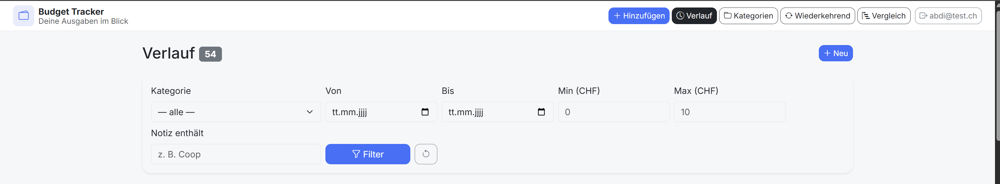

### 4.2 Benutzerkonten: Registrierung, Login & Logout (Issue #6)
- **Beschreibung & Nutzen:** Der Prototyp war eine **Single-User-App** — alle Daten lagen ungeschützt in gemeinsamen Collections. Diese Erweiterung führt **echte Benutzerkonten** mit Registrierung, Login und Logout ein. Nutzen: Die App wird mehrbenutzerfähig und schützt persönliche Finanzdaten hinter einer Authentifizierung. Abgrenzung zum Mindestumfang: Der Übungsumfang verlangt nur Erfassen/Bearbeiten von Daten ohne Authentifizierung; Benutzerkonten gehen klar darüber hinaus.
- **Wo umgesetzt:**
  - **Frontend:** Anmelde- und Registrierungsseiten (`src/routes/login/+page.svelte`, `src/routes/register/+page.svelte`); Logout-Button mit E-Mail-Anzeige in der Navigation (`src/routes/+layout.svelte`), nur sichtbar wenn eingeloggt.
  - **Backend:** Passwortprüfung mit `bcrypt.compare` und Setzen des Session-Cookies (`src/routes/login/+page.server.js`); Registrierung mit `bcrypt.hash` (Faktor 10), Dubletten-Prüfung und Anlegen von Standard-Kategorien (`src/routes/register/+page.server.js`); Logout via Cookie-Löschung (`src/routes/logout/+server.js`). Eine **Request-Hook** liest bei jedem Aufruf das Session-Cookie und hängt den User an `event.locals` (`src/hooks.server.js`); ein **Auth-Gate** im Layout leitet nicht eingeloggte Besucher auf `/login` um und eingeloggte von den Auth-Seiten weg (`src/routes/+layout.server.js`).
  - **Datenbank:** Neue `users`-Collection mit `createUser`, `getUserByEmail`, `getUserById` (`src/lib/db.js`); Passwörter werden nur als bcrypt-Hash gespeichert, nie im Klartext.
  - **Sicherheit:** Session-Cookie mit `httpOnly`, `sameSite: "strict"` und `secure` nur in Produktion (damit das Login lokal über http funktioniert, in der Produktion aber über https abgesichert ist).
- **Aus Evaluation abgeleitet?:** Nein — geplante Funktionserweiterung (Mehrbenutzerfähigkeit) über den Prototyp hinaus, Voraussetzung für #5.
- **Referenz:**
  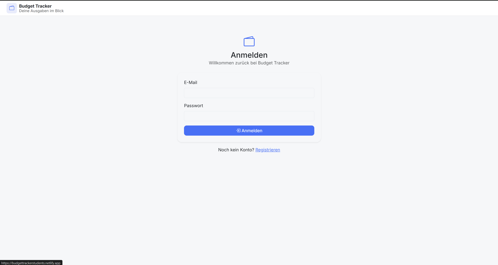

### 4.3 Datentrennung pro Benutzer (Multi-User-Datenschicht, Issue #5)
- **Beschreibung & Nutzen:** Aufbauend auf #6 wird die **gesamte Datenschicht pro Benutzer getrennt**: Jede Kategorie und jede Transaktion gehört genau einem User, und jede Datenbankabfrage filtert nach dessen `userId`. Nutzen: Benutzer sehen und verändern ausschliesslich ihre **eigenen** Daten — eine echte Daten-Isolation statt eines gemeinsamen Datentopfs. Abgrenzung zum Mindestumfang: Der Prototyp kannte kein `userId`; diese Erweiterung ist die strukturelle Voraussetzung für die Mehrbenutzerfähigkeit.
- **Wo umgesetzt:**
  - **Datenbank:** In `src/lib/db.js` erhält **jede** Funktion `userId` als erstes Argument; alle Queries filtern mit `{ userId }`, Lösch- und Update-Operationen enthalten `userId` im Filter (verhindert Zugriff auf fremde Datensätze). Das Löschen einer Kategorie entfernt kaskadierend nur die Transaktionen **desselben** Users.
  - **Backend:** Alle Server-Routen reichen die `userId` des angemeldeten Users (`locals.user._id`) an die DB-Funktionen durch (`src/routes/+page.server.js`, `add/`, `categories/`, `history/`).
  - **Frontend:** Keine sichtbare Änderung — die Trennung wirkt vollständig serverseitig.
- **Aus Evaluation abgeleitet?:** Nein — strukturelle Erweiterung, die direkt aus der Einführung der Benutzerkonten (#6) folgt.
- **Referenz:**

  

### 4.4 Mobiles Layout & Navigation (Issue #23) 
- **Beschreibung & Nutzen:** Der Prototyp hatte eine reine Desktop-Navigation mit englischen Titeln und Text-Buttons. Diese Erweiterung macht die Oberfläche **handytauglich und einheitlich**: eine Navigationsleiste, die den aktiven Menüpunkt markiert, auf schmalen Bildschirmen nur Icons zeigt, dazu eine schlanke Design-Schicht über Bootstrap und durchgängig deutsche Beschriftungen. Nutzen: bessere Bedienbarkeit auf dem Handy und ein ruhigeres, konsistentes Erscheinungsbild.
- **Wo umgesetzt:**
  - **Navigation:** `src/routes/+layout.svelte` — aktiver Menüpunkt via `class:active` / `aria-current` (über `$app/state`, `page.url.pathname`), Labels auf dem Handy ausgeblendet (`d-none d-md-inline`), klebende Kopfleiste (`sticky-top`), Logout-Button mit E-Mail.
  - **Design-Schicht:** neue `static/theme.css` (weiche Karten, runde Buttons, Fokus-Ring) plus Inter-Font, eingebunden in `src/app.html`.
  - **Komponente:** `src/lib/components/DeleteButton.svelte` vom Text- zum Icon-Button (platzsparend auf dem Handy).
  - **Texte:** englische Titel → deutsch (Übersicht, Ausgabe erfassen, Verlauf, Kategorien …) in den Seiten unter `src/routes/`.
- **Aus Evaluation abgeleitet?:** Nein — Umsetzung des ursprünglichen Mobile-first-Ziels (Kap. 3.3); im Usability-Test wurde die Handy-Bedienung nicht explizit bemängelt.
**Referenz:**

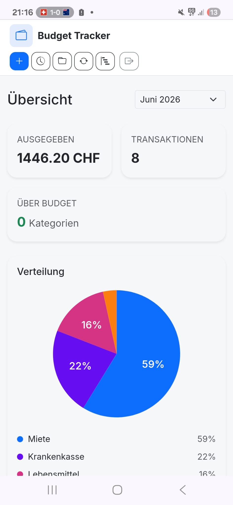

### 4.5 „Heute"-Button beim Datum (Issue #8)
- **Beschreibung & Nutzen:** Beim Erfassen einer Ausgabe lässt sich das Datumsfeld mit einem Klick auf „Heute" auf den aktuellen Tag setzen. Nutzen: Der häufigste Fall (Ausgabe von heute) ist ein einziger Klick statt manueller Datumseingabe — schnelleres, fehlerärmeres Erfassen. Manuelles Ändern bleibt jederzeit möglich.
- **Wo umgesetzt:**
  - **Frontend:** `src/routes/add/+page.svelte` — ein `$state`-Datumswert, an das `<input type="date">` gebunden (`bind:value`), plus ein „Heute"-Button (`input-group`) mit `setToday()`.
  - **Backend/Datenbank:** keine Änderung — das Datum wird wie bisher über die bestehende `create`-Action gespeichert.
- **Aus Evaluation abgeleitet?:** Ja — Usability-Test Kap. 3.5, Quick Win 1 (direkter Wunsch von T1, T2 und T3 nach einem „Heute"-Shortcut beim Datum).
- **Referenz:**

  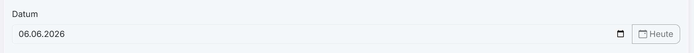

### 4.6 Icon-Auswahl mit Vorschau (Issues #9 & #24)
- **Beschreibung & Nutzen:** Beim Anlegen einer Kategorie wird das Icon nicht mehr als Bootstrap-Klassenname getippt, sondern aus einer **kuratierten Galerie** angeklickt — mit Live-Vorschau und einem Freitext-Fallback für seltene Icons. Nutzen: Nutzer müssen keine Icon-Namen kennen, Tippfehler entfallen, und das gewählte Icon ist sofort sichtbar. „Hinzufügen" ist erst möglich, wenn ein Icon gewählt wurde.
- **Wo umgesetzt:**
  - **Komponente (#24):** neue, wiederverwendbare `src/lib/components/IconPicker.svelte` — kuratierte Icon-Buttons, verstecktes `<input name="icon">` (zweiweg-gebunden via `$bindable`), Freitextfeld + Live-Vorschau.
  - **Frontend (#9):** `src/routes/categories/+page.svelte` — das frühere Freitext-Icon-Feld durch `<IconPicker>` ersetzt, Submit `disabled`, bis ein Icon gewählt ist.
  - **Backend/Datenbank:** unverändert — der Icon-Name wird über die bestehende `create`-Action gespeichert.
- **Aus Evaluation abgeleitet?:** Ja — Usability-Test Kap. 3.5, Quick Win 5 (T2, T3 und T5 empfanden die Eingabe des Bootstrap-Klassennamens als unintuitiv).
- **Referenz:**

  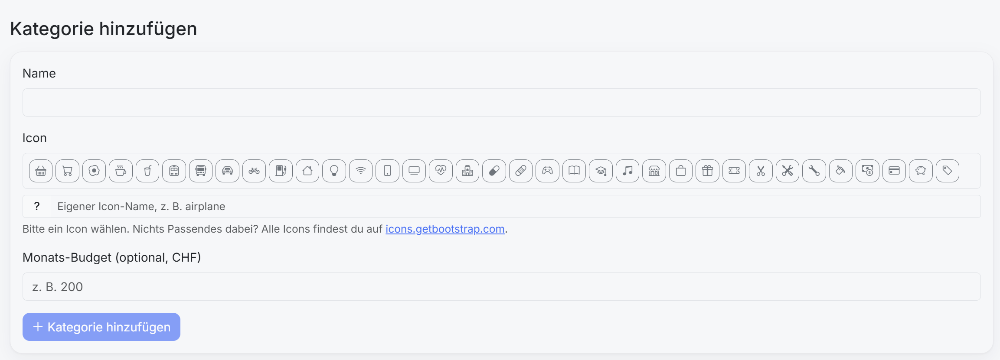

### 4.7 Dashboard mit Tortendiagramm (Issues #10 & #25)
- **Beschreibung & Nutzen:** Die Startseite zeigt für den gewählten Monat Kennzahlen (Ausgegeben, Anzahl Transaktionen, Anzahl Kategorien über Budget), ein **Tortendiagramm** der Ausgabenverteilung und den Budget-Status pro Kategorie. Der Monat ist über ein Dropdown wählbar. Nutzen: Statt einer reinen Liste bekommen Nutzer einen schnellen visuellen Überblick, wohin das Geld fliesst.
- **Wo umgesetzt:**
  - **Komponente (#25):** neue `src/lib/components/PieChart.svelte` — gefülltes Tortendiagramm als Inline-SVG (Kreissektoren per Geometrie berechnet, keine externe Library) inkl. Legende.
  - **Frontend (#10):** `src/routes/+page.svelte` — KPI-Karten, Monatsauswahl, Einbindung von `PieChart` und Budget-Status-Liste.
  - **Backend (#10):** `src/routes/+page.server.js` — lädt Monatsauswertung und Monatsliste, berechnet Summen und „über Budget"-Anzahl.
  - **Datenbank (#10):** `src/lib/db.js` — `getMonthlySummary(userId, month)` (Summe + Anzahl pro Kategorie) und `getUsedMonths(userId)` (Monate mit Transaktionen).
- **Aus Evaluation abgeleitet?:** Ja — Usability-Test Kap. 3.5, Verbesserung 6 (T1, T3 und T4 wünschten eine Grafik statt reiner Zahlen).
- **Referenz:**

  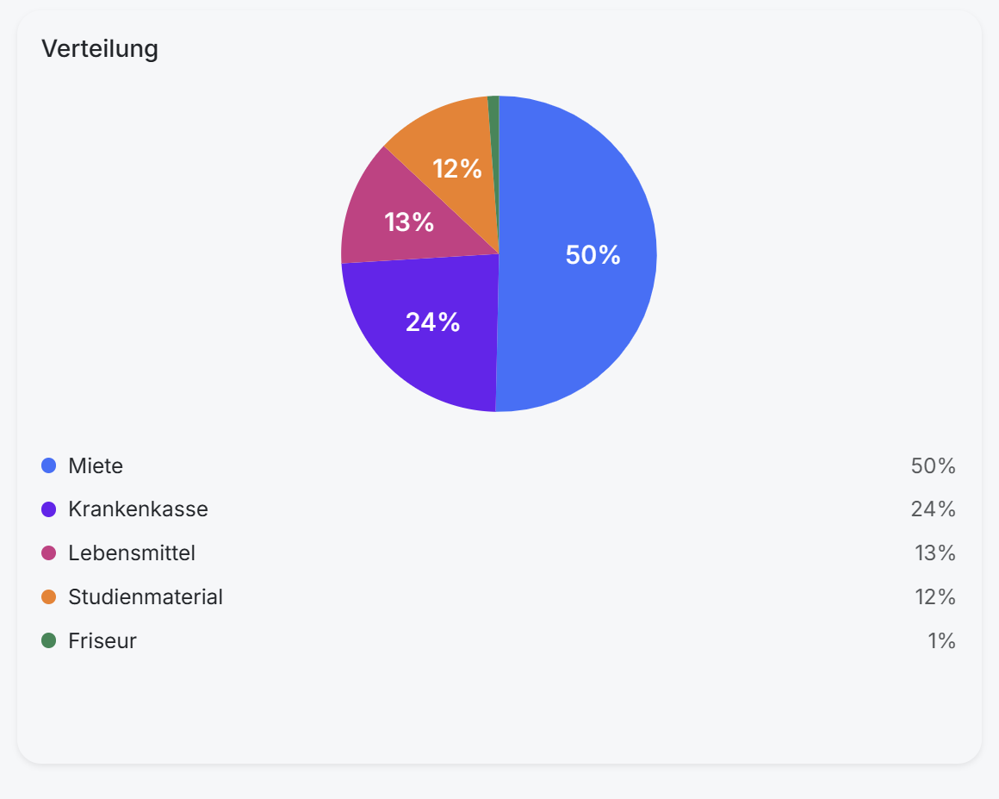

### 4.8 Budget pro Kategorie mit Fortschrittsbalken (Issues #11 & #26)
- **Beschreibung & Nutzen:** Jede Kategorie kann ein optionales **Monats-Budget** bekommen. Die Auslastung wird mit einem farbigen Fortschrittsbalken dargestellt (grün → gelb ab 80 % → rot ab 100 %), und das Dashboard zählt, wie viele Kategorien über ihrem Budget liegen. Nutzen: Nutzer sehen auf einen Blick, ob sie ihre selbst gesetzten Grenzen einhalten.
- **Wo umgesetzt:**
  - **Komponente (#26):** neue `src/lib/components/BudgetProgress.svelte` — Fortschrittsbalken mit Farbwarnung und Hinweis bei Überschreitung.
  - **Frontend (#11):** `src/routes/categories/+page.svelte` — optionales Budget-Feld im Formular, Budget-Anzeige in der Kategorienliste; Einbindung von `BudgetProgress` im Budget-Status des Dashboards.
  - **Backend (#11):** `src/routes/categories/+page.server.js` — liest `monthlyBudget` aus dem Formular und reicht es weiter.
  - **Datenbank (#11):** `src/lib/db.js` — `createCategory` speichert `monthlyBudget` (oder `null`).
- **Aus Evaluation abgeleitet?:** Ja — Usability-Test Kap. 3.5, Verbesserung 7 (T4 und T5 wünschten Budget-Limits mit Warnung bei Überschreitung).
- **Referenz:**

  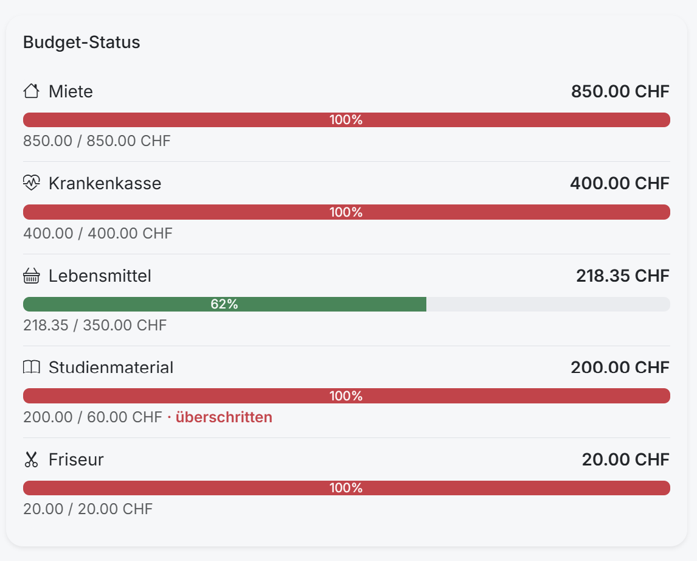

### 4.9 Transaktion bearbeiten (Issue #13)
- **Beschreibung & Nutzen:** Bereits erfasste Transaktionen lassen sich nachträglich korrigieren (Betrag, Kategorie, Datum, Notiz), statt sie löschen und neu anlegen zu müssen. Nutzen: Tippfehler oder falsch zugeordnete Kategorien sind mit wenigen Klicks behoben.
- **Wo umgesetzt:**
  - **Frontend:** eigene Bearbeiten-Seite `src/routes/history/[id]/+page.svelte` mit vorausgefülltem Formular; ein Stift-Link pro Eintrag in `src/routes/history/+page.svelte` führt dorthin.
  - **Backend:** `src/routes/history/[id]/+page.server.js` — `load` holt die Transaktion, die Form Action `?/update` speichert die Änderungen und leitet zurück auf `/history`.
  - **Datenbank:** `getTransaction(userId, id)` und `updateTransaction(userId, id, { … })` in `src/lib/db.js` — beide mit `userId` im Filter, sodass nur eigene Einträge geändert werden können.
- **Aus Evaluation abgeleitet?:** Ja — Usability-Test Kap. 3.5, Quick Win 2 (häufigster Schmerzpunkt bei Korrekturen: T3, T4, T5 wollten bearbeiten statt löschen + neu).
- **Referenz:**

  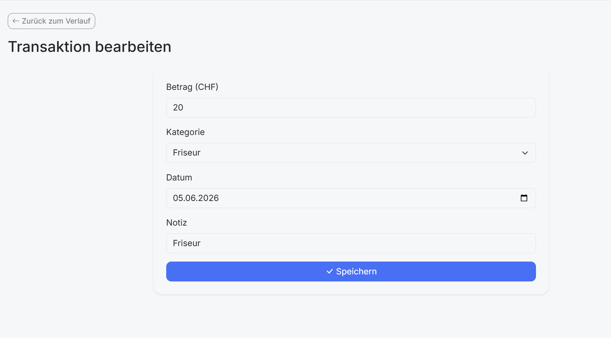

### 4.10 Kategorie bearbeiten (Issue #14)
- **Beschreibung & Nutzen:** Bestehende Kategorien lassen sich nachträglich anpassen — Name, Icon (über den IconPicker) und Monats-Budget — ohne sie löschen und neu anlegen zu müssen. Nutzen: Kategorien können mit der Zeit umbenannt oder mit einem Budget versehen werden, ohne die zugehörigen Transaktionen zu verlieren.
- **Wo umgesetzt:**
  - **Frontend:** eigene Bearbeiten-Seite `src/routes/categories/[id]/+page.svelte` mit vorausgefülltem Formular (inkl. IconPicker und Budget-Feld); ein Stift-Link pro Kategorie in `src/routes/categories/+page.svelte` führt dorthin.
  - **Backend:** `src/routes/categories/[id]/+page.server.js` — `load` holt die Kategorie, die Form Action `?/update` speichert die Änderungen und leitet zurück auf `/categories`.
  - **Datenbank:** `getCategory(userId, id)` und `updateCategory(userId, id, { … })` in `src/lib/db.js` — beide mit `userId` im Filter, sodass nur eigene Kategorien geändert werden können.
- **Aus Evaluation abgeleitet?:** Ja — Usability-Test Kap. 3.5, Quick Win 3 (gleiche Korrektur-Lücke wie bei Transaktionen: Tipp-/Icon-Fehler erzwangen eine Neu-Anlage).
- **Referenz:** 

  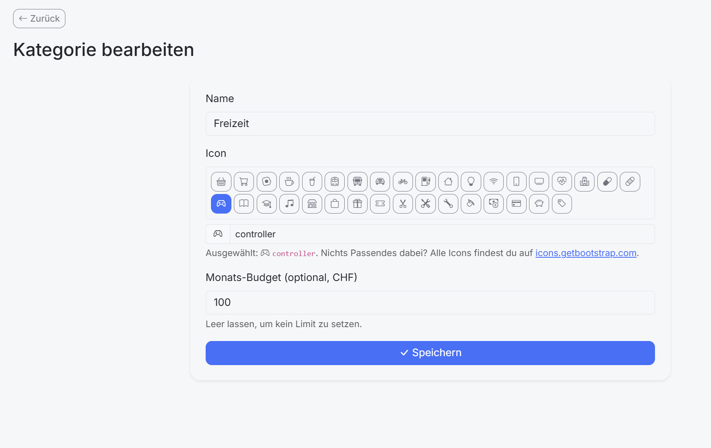

### 4.11 Wiederkehrende Ausgaben / Fixkosten (Issue #15)
- **Beschreibung & Nutzen:** Monatliche Fixkosten (z. B. Miete, ÖV-Abo, Krankenkasse) lassen sich einmal hinterlegen — mit Betrag, Kategorie, Tag im Monat und Notiz — und werden danach **automatisch jeden Monat einmal** als Transaktion erzeugt. Nutzen: Wiederkehrende Beträge müssen nicht jeden Monat von Hand erfasst werden; die Auswertung bleibt trotzdem vollständig.
- **Wo umgesetzt:**
  - **Frontend:** eigene Seite `src/routes/recurring/+page.svelte` (Liste + Anlegen/Löschen) und ein Navigationspunkt „Wiederkehrend" in `src/routes/+layout.svelte`.
  - **Backend:** `src/routes/recurring/+page.server.js` (Form Actions `?/create` und `?/delete`); der Generator wird bei jedem Laden in `src/routes/+layout.server.js` aufgerufen.
  - **Datenbank:** neue Collection `recurringTransactions` mit `getRecurring`, `createRecurring`, `deleteRecurring` und `generateRecurringForCurrentMonth` in `src/lib/db.js`. Die Erzeugung ist **idempotent** (Feld `lastGeneratedMonth`), sodass mehrfaches Laden im selben Monat keine Doppeleinträge erzeugt.
- **Aus Evaluation abgeleitet?:** Ja — Usability-Test Kap. 3.5, Verbesserung 8 (T4 und T5 empfanden das monatliche Wiedererfassen von Fixkosten wie ÖV-Abo als unnötigen Aufwand).
- **Referenz:**

  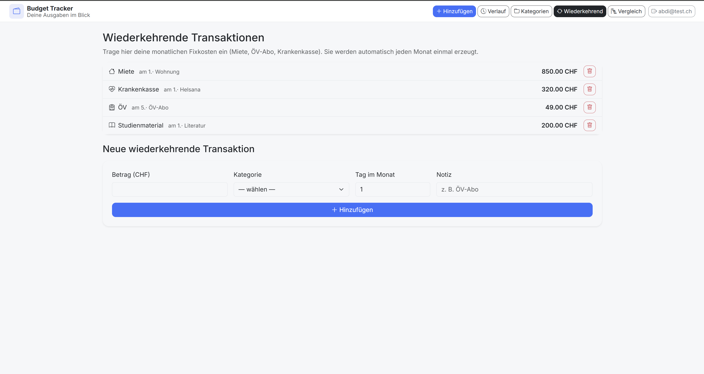

### 4.12 Monatsvergleich (Issue #16)
- **Beschreibung & Nutzen:** Zwei Monate lassen sich nebeneinander vergleichen — die Ausgaben pro Kategorie samt Differenz (rot = mehr, grün = weniger ausgegeben) und einer Total-Zeile. Standardmässig wird der Vormonat dem aktuellen Monat gegenübergestellt. Nutzen: Trends und Ausreisser werden auf einen Blick sichtbar („Wo habe ich diesen Monat mehr ausgegeben?").
- **Wo umgesetzt:**
  - **Frontend:** eigene Seite `src/routes/compare/+page.svelte` mit zwei Monats-Dropdowns und einer Vergleichstabelle (farbige Differenz pro Kategorie); Navigationspunkt „Vergleich" in `src/routes/+layout.svelte`.
  - **Backend:** `src/routes/compare/+page.server.js` — lädt die Auswertung beider Monate, berechnet pro Kategorie die Differenz und die Totale.
  - **Datenbank:** keine neue Funktion — wiederverwendet `getMonthlySummary(userId, month)` und `getUsedMonths(userId)` aus `src/lib/db.js`.
- **Aus Evaluation abgeleitet?:** Ja — Usability-Test Kap. 3.5, Verbesserung 9 (T4 wollte „gebe ich mehr aus als letzten Monat?" beantworten können).
- **Referenz:**

  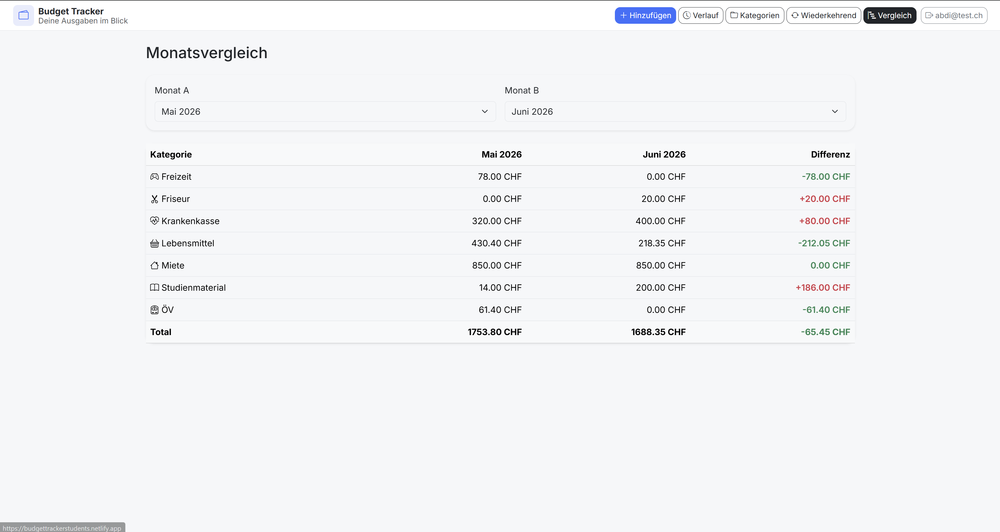

### 4.13 Beleg-Scan mit KI / OCR (Issues #19–#22)
- **Beschreibung & Nutzen:** Beim Erfassen kann ein Foto des Kassenbelegs hochgeladen werden. Eine KI (OpenAI) liest daraus **Betrag, Datum und Händler** aus, füllt die Formularfelder automatisch vor und schlägt anhand des Händlers eine passende **Kategorie** aus den eigenen Kategorien vor. Der Nutzer prüft und bestätigt die Werte vor dem Speichern. Nutzen: deutlich schnelleres, fehlerärmeres Erfassen — gerade unterwegs per Handy-Foto. Das Bild wird dabei **nur zum Auslesen** verwendet und **nicht gespeichert** (datensparsam, keine grossen Dokumente in der DB).
- **Wo umgesetzt:**
  - **Frontend (#19/#21/#22):** `src/routes/add/+page.svelte` — Datei-/Kamera-Feld mit Vorschau, „Beleg auslesen"-Button mit Lade-/Status-Anzeige; die erkannten Werte (Betrag, Datum, Notiz, Kategorie) werden an die Formularfelder gebunden und vorausgefüllt.
  - **Backend (#20/#22):** Endpoint `POST /add/scan` (`src/routes/add/scan/+server.js`) — nimmt das Foto entgegen, ruft die KI auf und bildet den vorgeschlagenen Kategorienamen auf eine echte Kategorie-ID ab. Auth-Prüfung direkt im Endpoint (`locals.user`).
  - **KI-Anbindung (#20/#22):** `src/lib/ai.js` — Aufruf von OpenAI (`gpt-4o-mini`, Bild-/Vision-fähig) mit JSON-Antwort. Schlüssel aus der Umgebungsvariable `OPEN_AI_KEY`; ohne Schlüssel meldet der Scan „KI ist nicht konfiguriert" und die App bleibt voll nutzbar.
  - **Konfiguration:** `OPEN_AI_KEY` in `.env` (lokal) bzw. in den Netlify-Umgebungsvariablen (Deployment). Datenbank unverändert.
- **Aus Evaluation abgeleitet?:** Ja — Usability-Test Kap. 3.5, Verbesserung 11 (Off-Site-Tester T4 und T5 wünschten eine Foto-/Beleg-Erfassung statt manuellem Abtippen).
- **Referenz:**

  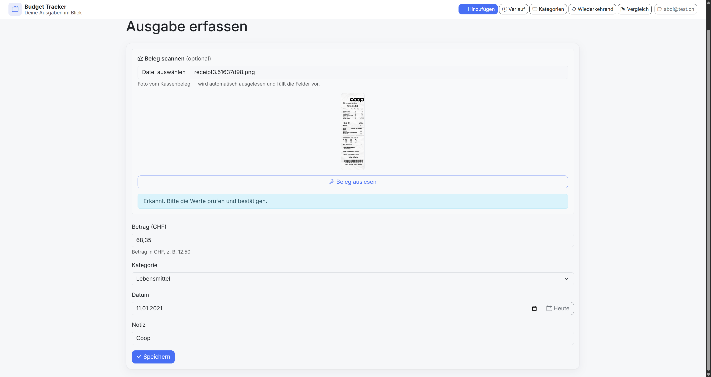

## 5. Projektorganisation [Optional]

### 5.1 Repository & Strukturübersicht der Arbeit

- **Repository:** [github.com/Abdirahman2002/BudgetTracker2](https://github.com/Abdirahman2002/BudgetTracker2) (öffentlich)

- **Strukturübersicht (Endstand):** 

  ```
  BudgetTracker2/
  ├── src/
  │   ├── app.html                          # HTML-Shell, lädt Bootstrap + theme.css
  │   ├── hooks.server.js                   # Session-Cookie lesen → locals.user (#6)
  │   ├── lib/
  │   │   ├── db.js                         # MongoDB-Connection + CRUD (alle Funktionen pro userId)
  │   │   ├── ai.js                         # OpenAI-Anbindung für Beleg-Scan (#20)
  │   │   ├── index.js                      # $lib-Barrel
  │   │   ├── assets/favicon.svg
  │   │   └── components/
  │   │       ├── CategoryBadge.svelte      # Icon + Name
  │   │       ├── Money.svelte              # CHF-Formatierung
  │   │       ├── DeleteButton.svelte       # Lösch-Button (Icon, #23)
  │   │       ├── IconPicker.svelte         # Icon-Galerie mit Vorschau (#24)
  │   │       ├── PieChart.svelte           # Tortendiagramm (Inline-SVG, #25)
  │   │       └── BudgetProgress.svelte     # Budget-Fortschrittsbalken (#26)
  │   └── routes/
  │       ├── +layout.svelte                # Header + Navigation (aktiv, mobil, Logout)
  │       ├── +layout.server.js             # Auth-Gate + Generator wiederkehrender Ausgaben
  │       ├── +page.svelte / .server.js     # Overview / Dashboard mit Diagramm (#10)
  │       ├── add/+page.svelte / .server.js # Ausgabe erfassen (+ Heute-Button #8, Beleg #19)
  │       │   └── scan/+server.js           # Endpoint Beleg auslesen (#20)
  │       ├── history/+page.svelte / .server.js     # Verlauf + Filter (#12)
  │       │   └── [id]/+page.svelte / .server.js    # Transaktion bearbeiten (#13)
  │       ├── categories/+page.svelte / .server.js  # Kategorien (Budget #11, IconPicker #9)
  │       │   └── [id]/+page.svelte / .server.js    # Kategorie bearbeiten (#14)
  │       ├── compare/+page.svelte / .server.js     # Monatsvergleich (#16)
  │       ├── recurring/+page.svelte / .server.js   # Wiederkehrende Ausgaben (#15)
  │       ├── login/+page.svelte / .server.js       # Login (#6)
  │       ├── register/+page.svelte / .server.js    # Registrierung (#6)
  │       └── logout/+server.js                     # Logout (#6)
  ├── static/              # theme.css (#23), robots.txt, favicon
  ├── doc/                 # Projektdoku (databasearchitecture.drawio.svg)
  ├── img/                 # Skizzen & Screenshots für die README
  ├── build/               # Netlify-Build-Output (generiert)
  ├── README.md            # diese Projektdokumentation
  ├── package.json         # Abhängigkeiten & Scripts
  ├── svelte.config.js     # SvelteKit-/Adapter-Konfiguration
  ├── netlify.toml         # Deployment-Konfiguration
  └── .env                 # Secrets (DB_URI, OPEN_AI_KEY) — via .gitignore ausgeschlossen
  ```

- **Arbeitsorganisation:** Die Arbeit gliedert sich in zwei Phasen, die sich auch im Repo abbilden. Zuerst der **Prototyp** (Kap. 3 — Design-Sprint von Understand bis Validate, Mindestumfang), danach der **Endausbau** in Form klar abgegrenzter **Erweiterungen** (Kap. 4), die jeweils einem Issue und einem Meilenstein zugeordnet sind. Jede Erweiterung wird erst umgesetzt und anschliessend direkt in der README dokumentiert — so bleiben Code-Stand und Dokumentation synchron.

### 5.2 Vorgehen

Das Projekt wird **issue-getrieben pro Feature** entwickelt: Jede abgrenzbare Funktion erhält ein eigenes GitHub-Issue, das einem Meilenstein zugeordnet ist. Der Ablauf pro Issue ist immer derselbe:

1. **Issue** anlegen und einem Meilenstein zuordnen (Was, Warum, Akzeptanz).
2. **Umsetzung** — Feature implementieren (`feat`-Commit, ggf. vorbereitende Komponenten-Commits).
3. **Dokumentation** — die Erweiterung in Kap. 4 der README beschreiben (`docs`-Commit), inkl. „Wo umgesetzt" und Referenz.
4. **Abschluss** — Issue schliessen, sobald Funktion und Doku stehen.

### 5.3 Issue-Management mit Meilensteinen

Geplant und verfolgt wird über **GitHub Issues** und **Meilensteine**. Die Meilensteine sind nach Abhängigkeit geschnitten — jeder baut auf dem vorherigen auf (Fundament → Erfassen → Auswerten → Bearbeiten → Abschluss), das optionale Beleg-Scan-Feature steht bewusst am Ende.

| Meilenstein | Fokus | Status |
|---|---|---|
| **M1 – Fundament & Login** | Technische Basis, auf der alle Seiten aufbauen (Auth, Datentrennung) | 3/3 Issues abgeschlossen |
| **M2 – Erfassen** | Daten in die App bringen — ohne Erfassen nichts auszuwerten | 3/3 Issues abgeschlossen |
| **M3 – Dashboard & Budget** | Erfasste Daten visuell auswerten (Diagramm, Budget-Limits)  | 5/5 Issues abgeschlossen |
| **M4 – History & Bearbeiten** | Vergangene Einträge mittels Filter durchsuchen und korrigieren | 3/3 Issues abgeschlossen |
| **M5 – Auswertung** | Tiefere Analyse über einzelne Monate hinaus (Monatsvergleich) | 2/2 Issues abgeschlossen |
| **M6 – Abschluss & Deploy** | App testen und produktiv online stellen | 2/2 Issues abgeschlossen |
| **M7 – Beleg-Scan (KI/OCR)** |Einbindung automatischer Erfassung einer Transaktion mittels Beleg | 4/4 Issues abgeschlossen |

Die einzelnen Issues sind in Kap. 4 referenziert (z. B. Login #6, Datentrennung #5, Dashboard #10/#25, Budget #11/#26, Verlauf-Filter #12, Transaktion bearbeiten #13, Monatsvergleich #16, Beleg-Scan #19–#22). Den aktuellen Stand zeigen die [Meilensteine](https://github.com/Abdirahman2002/BudgetTracker2/milestones) und [Issues](https://github.com/Abdirahman2002/BudgetTracker2/issues) im Repository.

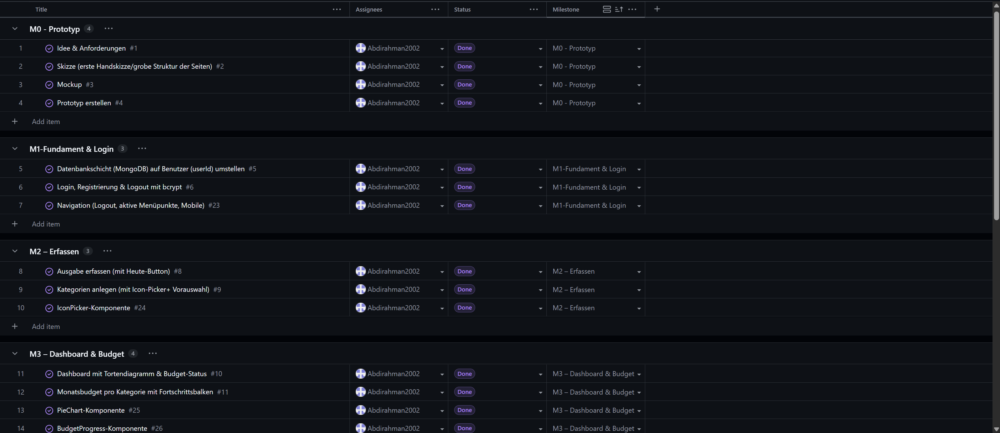
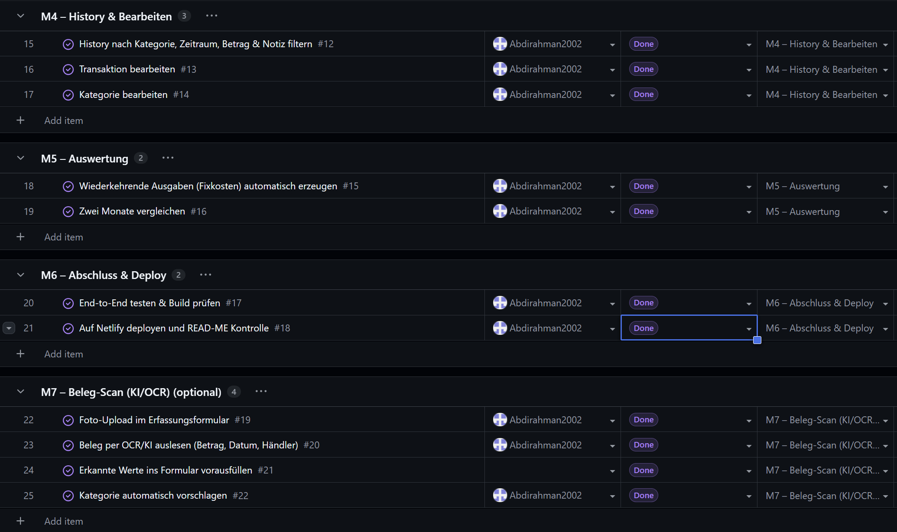

### 5.4 Commit-Praxis

Es kommen diese sprechende Commits zum Einsatz: 

- **`feat`** — neue Funktion (z. B. feat(auth): Login, Registrierung & Logout mit bcrypt)
- **`docs`** — Dokumentation/README (z. B. docs: 4.12 Monatsvergleich dokumentieren)
- **`fix`** — Fehlerbehebung (z. B. fix(deploy): Netlify-Adapter ergänzen)
- **`style`** — rein optische/nicht-funktionale Änderung (z. B. style(ui): Wallet-Favicon statt SvelteKit-Logo)

Der `scope` benennt den betroffenen Bereich (`auth`, `db`, `ui`, `history`, `add`, `categories`, `dashboard`, `compare`, `recurring`, `ocr` …). 

Pro Feature entsteht typischerweise ein **`feat`-Commit für die Umsetzung und ein separater `docs`-Commit für die Dokumentation** — Code und Doku bleiben dadurch im Verlauf klar getrennt und einem Issue zuordenbar. Commits sind bewusst **klein und atomar**, sodass die Git-History die Projektentwicklung Schritt für Schritt nachvollziehbar macht.

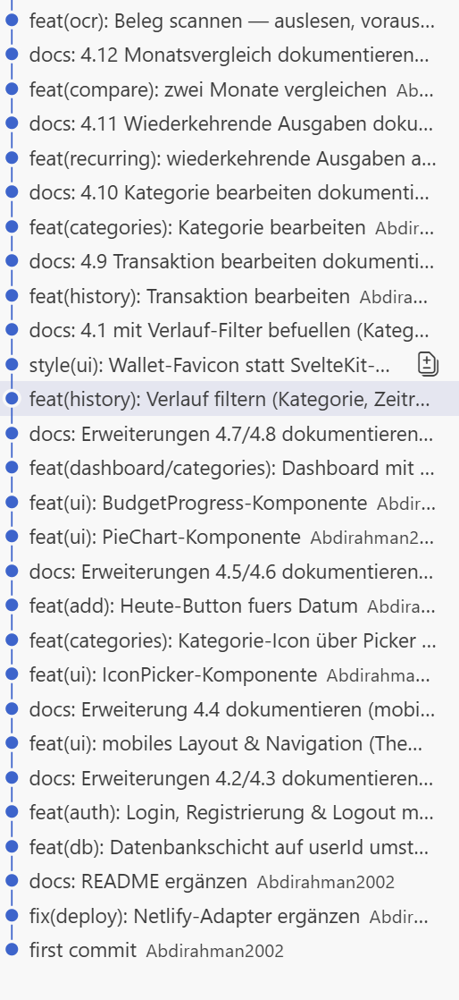

## 6. KI-Deklaration
Die folgende Deklaration ist verpflichtend und beschreibt den Einsatz von KI im Projekt.

### 6.1 KI-Tools
- **Eingesetzte Tools**: Für die Erweiterungen (Kap. 4) und das Ausformulieren dieser Dokumentation habe ich Claude (Anthropic) als KI-Assistenten genutzt. Den **Prototyp** (Kap. 3) habe ich **ohne KI** selbst auf Basis meines eigenen Wissens erstellt.

- **Zweck & Umfang**: Unterstützung durch KI habe ich für Codevorschläge bei neuen Konzepten (Authentifizierung, KI-/OCR-Anbindung, Dashoboard-Diagramm) genommen und zum Ausformulieren dieser README. Den grundlegenden Aufbau, die Architekturentscheidungen und das Testing habe ich selbst erarbeitet; die KI-Vorschläge habe ich jeweils geprüft, angepasst und integriert.

- **Eigene Leistung (Abgrenzung):**

  - **Selbst gemacht (ohne KI, Bughilfe):** Der Prototyp:
    - **Overview (Startseite):** `src/routes/+page.svelte` + `+page.server.js`
    - **Ausgabe erfassen (Add):** `src/routes/add/+page.svelte` + `add/+page.server.js`
    - **Verlauf (History):** `src/routes/history/+page.svelte` + `history/+page.server.js`
    - **Kategorien (Categories):** `src/routes/categories/+page.svelte` + `categories/+page.server.js`
    - **Layout & Navigation:** `src/routes/+layout.svelte`, `src/app.html`
    - **Datenbank-Anbindung (CRUD):** `src/lib/db.js` (ursprüngliche Funktionen)
    - **Wiederverwendbare Komponenten:** `src/lib/components/CategoryBadge.svelte`, `Money.svelte`, `DeleteButton.svelte`
    - **Verlauf-Filter (#12):** Erweiterung von `history/+page.svelte` + `+page.server.js`
    - **Transaktion/Kategorie bearbeiten (#13/#14):** `src/routes/history/[id]/+page.svelte` + `+page.server.js`, `categories/[id]/+page.svelte` + `+page.server.js`
    - **„Heute"-Button (#8):** Anpassung von `add/+page.svelte`
    - **Monatsvergleich (#16):** `src/routes/compare/+page.svelte` + `+page.server.js`

  - **Mit Unterstützung gemacht:** Hier waren mir Konzept und Ziel klar; die KI half bei Umsetzung und Detailfragen.
    - **Login/Registrierung/Logout (#6):** `src/hooks.server.js`, `src/routes/+layout.server.js`, `src/routes/login/+page.svelte` + `+page.server.js`, `register/+page.svelte` + `+page.server.js`, `logout/+server.js`
    - **Datentrennung pro Benutzer (#5):** Erweiterung von `src/lib/db.js` um `userId` und Anpassung aller `+page.server.js`
    - **Mobiles Layout (#23):** `static/theme.css`, Anpassung von `src/routes/+layout.svelte` und `DeleteButton.svelte`
    - **Wiederkehrende Ausgaben (#15):** `src/routes/recurring/+page.svelte` + `+page.server.js`
    - **Icon-Picker (#9/#24):** `src/lib/components/IconPicker.svelte`
    - **Budget-Fortschrittsbalken (#11/#26):** `src/lib/components/BudgetProgress.svelte`

  - **Mit Hilfe gemacht (war für mich neu):** Hier habe ich Code-Abschnitte aus den KI-Vorschlägen direkt übernommen und in mein Projekt eingebaut, weil mir das Themengebiet neu war.
    - **KI-/OCR-Beleg-Scan (#19–#22):** `src/routes/add/scan/+server.js`, `src/lib/ai.js` (OpenAI-Vision, JSON-Extraktion, Händler→Kategorie-Zuordnung) — ein neues Themengebiet (LLM-Integration)
    - **Tortendiagramm (#10/#25):** `src/lib/components/PieChart.svelte` sowie der Dashboard-Teil von `src/routes/+page.svelte` + `+page.server.js` (Kreissektoren per Geometrie/Trigonometrie ohne externe Library)

### 6.2 Prompt-Vorgehen

Die gesamte Arbeit — Planung, Aufteilung in Issues und Meilensteine, Architektur, Code und Dokumentation — habe ich selbst geschrieben und verantwortet. Die KI habe ich nur als Werkzeug für einzelne Detail- Umsetzungsfragen genutzt: mit dem nötigen Ausschnitt meines Codes und dem konkreten Ziel. Vorschläge habe ich nicht blind übernommen, sondern gelesen, verstanden, angepasst und nur integriert, was zu meinem bestehenden Muster passte. Jede Funktion habe ich anschliessend selbst lokal getestet.

Die verwendeten Bibliotheken (`mongodb`, `bcrypt`, Bootstrap, OpenAI) sind frei nutzbar und über ihre offizielle Dokumentation eingebunden. Den finalen Code verstehe und verantworte ich selbst.

### 6.3 Reflexion
Das Projekt hat gezeigt, dass ein bewusst schlanker Funktionsumfang trägt: Der Prototyp deckte die Kern-Use-Cases zuverlässig ab, und die Usability-Tests (Kap. 3.5) haben klar gemacht, welche Erweiterungen wirklich gebraucht werden. Das schrittweise, issue-weise Vorgehen mit Meilensteinen hat sich bewährt — jede Funktion blieb überschaubar und der `main`-Branch stets lauffähig. Herausfordernd war vor allem der Schritt vom Single-User-Prototyp zur Mehrbenutzerfähigkeit, weil dafür die gesamte Datenschicht umgebaut werden musste. Grenzen des Ergebnisses bleiben offen (z. B. keine Jahresübersicht, keine Geräte-Synchronisation); als nächste Schritte wären diese sowie eine sauberere mobile Optimierung sinnvoll. Insgesamt hat mir das Projekt den vollständigen Ablauf von der Problemanalyse über Prototyp und Test bis zur ausgebauten Anwendung vermittelt.

## 7. Anhang [Optional]
Beispiele:
- **Quellen:**
  - Bootstrap — CSS-Framework: [getbootstrap.com](https://getbootstrap.com/)
  - Bootstrap Icons — Icon-Bibliothek: [icons.getbootstrap.com](https://icons.getbootstrap.com/)
  - OpenAI — KI-/Vision-Modell für den Beleg-Scan: [openai.com](https://openai.com/)
  - Claude (Anthropic) — KI-Assistent für Erweiterungen und Dokumentation: [claude.ai](https://claude.ai/)

